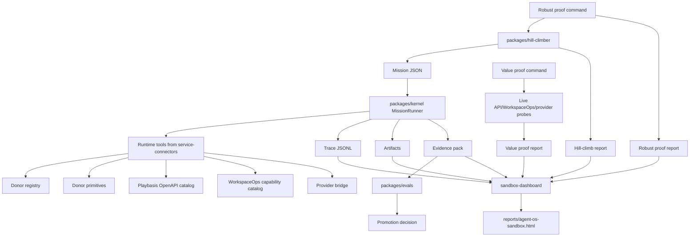

# Playbasis Agent OS PoV Handover

Last updated: 2026-07-05

This note is for the next engineer or model taking over the Playbasis Agent OS proof of value. The goal is not to preserve a demo. The goal is to turn this into a high-performance, monorepo-backed harness kernel that can run useful agent missions, measure them, improve them, and eventually export the generic parts safely.

Treat the current repo as a working internal proof, not a finished architecture. Your job is to make it 10x better while preserving the proof boundary: real evidence, no leaked secrets, no ungoverned writes, and no claims that outrun the measured results.

## Executive State

Active worktree:

- `<repo-root>`
- Branch before final docs/check-in: `codex/navigator-rendered-pixel-loop`
- Local `main` is the fast-forward target for this integration pass.

Frozen donor archive:

- `../playbasis-agent-os-donor-copy`
- Do not mutate this archive. It is the raw donor baseline and verification source.

Live Playbasis service substrate:

- `../playbasis-platform`
- This is the monorepo that provides OpenAPI, WorkspaceOps, super prompts, provider/env paths, scripts, runtime docs, and service behavior.

High-level proof status:

- The PoV can run mission graphs, write traces, write artifacts, generate evidence packs, score evals, make promotion decisions, run hill-climb candidates, execute robust multi-profile gates, call real Playbasis/WorkspaceOps/provider paths when explicitly enabled, warehouse accumulated runs, run CEO-sim/value/audit/knowledge/OSS-export proof families, exercise router-lab Phase 0 telemetry, and render static sandbox/Navigator evidence dashboards.
- Latest dashboard: `reports/agent-os-sandbox.html`
- Latest dashboard data: `reports/agent-os-sandbox-data.json`

Latest measured proof shown by the sandbox dashboard (`2026-07-05T16:25:57.642Z`):

- `133` hill-climb sessions
- `532` candidate runs
- `562` evidence packs
- `284` promoted runs
- `562` zero-leak runs
- Real Playbasis API probes: `19/20`
- Real WorkspaceOps probes: `13/14`
- Provider smoke/value proof coverage: `1/1`, latest provider status `200`, parsed JSON true, `174` tokens
- Latest robust proof: `robust-proof-workspaceops-launch-pack-20260705162509280-6378d400`, `13/13` gates across `fixture` and `local-monorepo`
- Latest value proof: `value-proof-workspaceops-launch-pack-staging-sandbox-20260705122454869-0084e615`, `6/6` gates, training lift `+0.5239`, held-out lift `+0.0413`
- Latest router Phase 0 fixture proof: `router-phase0-fixture-20260705153235-22b86d5c`, `2/2` hash-only router telemetry records

## Reading Order

Start here in this PoV repo:

1. `docs/VISION.md`
2. `docs/DOCS_INDEX.md`
3. `README.md`
4. `docs/ROBUST_PROOF_PROTOCOL.md`
5. `docs/NAVIGATOR_PATH_PLANNING_AND_MODEL_COUNCIL_PLAN.md`
6. `docs/LOSS_FUNCTION_DESIGN_NAVIGATOR_ADDENDUM.md`
7. `docs/PROOF_SOTA_RESEARCH_COMMERCIALIZATION_PLAN.md`
8. `docs/MODEL_ROUTER_EVAL_HANDOVER.md`
9. `docs/MODEL_ROUTER_EVAL_PRD.md`
10. `docs/AGENT_OS_POV_HANDOVER.md`
11. `package.json`
12. `examples/workspaceops-launch-pack/mission.json`
13. `packages/kernel/src/index.ts`
14. `packages/navigator/src/index.ts`
15. `packages/router-lab/src/index.ts`
16. `packages/cli/src/index.ts`
17. `packages/cli/src/super-plan.ts`
18. `packages/service-connectors/src/index.ts`
19. `packages/donor-primitives/src/index.ts`
20. `packages/run-warehouse/src/index.ts`
21. `packages/sandbox-dashboard/src/index.ts`

Canonization note:

- `docs/VISION.md` is now the consolidated doctrine extracted from the raw
  `docs/VISION_NOTES.md` source notes and existing deep dives.
- `docs/VISION_NOTES.md` remains useful source material, but it is not the
  current proof report, README replacement, or claim boundary.
- When older handover language sounds more ambitious than `docs/VISION.md` or
  `docs/ROBUST_PROOF_PROTOCOL.md`, use the stricter claim.

LFD incorporation note:

- `docs/LOSS_FUNCTION_DESIGN_NAVIGATOR_ADDENDUM.md` section 1.1 now captures
  the external LFD essay's concrete implications for this repo: loss-function
  goals, large generated eval families, filesystem-level blinding, forced
  entropy, Progress Sharpe selection, agent-facing instruments, and the
  private-eval moat.
- Treat that section as the current Navigator design memo. It is the bridge
  between the essay and executable PoV work.
- Do not copy any external `/lfd-design` skill code or prompts into this repo
  until license/reuse terms are reviewed; use it only as a reference for
  paraphrased design notes.

Then read the upstream Playbasis context:

1. `../playbasis-platform/AGENTS.md`
2. `../playbasis-platform/AGENTS_CORE_KNOWLEDGE_PLAYBASIS.md`
3. `../playbasis-platform/NEW_PLAYBASIS_AI.md`
4. `../playbasis-platform/docs/RUNNERS_HARNESSES_EVALS_ASSET_INVENTORY.md`
5. `../playbasis-platform/docs/CROSS_REPO_ORCHESTRATION_RND_ASSET_INVENTORY.md`
6. `../playbasis-platform/docs/AGENTIC_AI_OPERATING_SYSTEM_HANDOVER.md`
7. `../playbasis-platform/docs/API_TOOLBOX_FUNCTIONAL_CATALOG.md`
8. `../playbasis-platform/docs/AGENT_RUNTIME_MATURITY_ROADMAP.md`
9. `../playbasis-platform/docs/AGENT_RUNTIME_AND_WORKSPACE_OPS_SOTA_AUDIT_2026-05-04.md`

The API toolbox skill is available here and was part of the upstream context:

- `~/.codex/skills/api-toolbox-catalog/SKILL.md`
- `~/.codex/skills/api-toolbox-catalog/scripts/generate_api_toolbox.js`

The skill generator supports YAML OpenAPI parsing without requiring callers to set `NODE_PATH`. Use it from `../playbasis-platform` when you need a fresh functional API capability catalog:

```bash
node ~/.codex/skills/api-toolbox-catalog/scripts/generate_api_toolbox.js \
  --openapi docs/api/openapi.yaml \
  --out reports/api-toolbox.md \
  --include-examples
```

## What Has Been Done

### 1. Donor Archive Was Frozen and Verified

The donor-copy archive at `../playbasis-agent-os-donor-copy` is treated as raw material and a verification baseline.

Important files:

- `../playbasis-agent-os-donor-copy/scripts/verify-donor-manifest.mjs`
- `../playbasis-agent-os-donor-copy/reports/donor-script-manifest.json`
- `../playbasis-agent-os-donor-copy/reports/donor-copy-verification.json`
- `raw-donors/` in the PoV worktree
- `reports/donor-script-manifest.json` in the PoV worktree
- `reports/donor-copy-verification.json` in the PoV worktree

Current verification gate expects `1063` frozen donor files. The robust proof uses this as a hard gate named `frozen-donor-archive`.

### 2. A Clean Internal PoV Worktree Was Created

The active PoV lives at `<repo-root>`.

The committed branch history plus current integration work now includes the original harness, live value proof, Navigator path/visual loops, router-lab Phase 0, CEO-sim/value/audit/knowledge proof families, run warehouse, and OSS export verification. Recent committed branch tip before this docs/check-in pass:

```text
0526c2f feat: descend navigator rendered pixel loop
c840d61 feat: port navigator shared-shell targets
72964c6 feat: descend navigator rendered pixel loop
aa735f2 feat: add navigator rendered pixel loop
0b1a5b5 docs: add design system, app mockups, and strategy docs
```

### 3. Mission Kernel Exists

File:

- `packages/kernel/src/index.ts`

Core exported concepts:

- `Mission`
- `MissionStep`
- `RuntimeToolSpec`
- `ToolExecutionContext`
- `ToolResult`
- `Artifact`
- `TraceEvent`
- `EvalResult`
- `EvidencePack`
- `PromotionDecision`
- `RedactionGuard`
- `MissionRunner`
- `readMission`
- `validateMission`
- `writeJson`
- `renderPromotionReport`

Behavior:

- Reads a mission JSON file.
- Executes steps against registered runtime tools.
- Writes `runs/<runId>/trace.jsonl`.
- Writes artifacts under `runs/<runId>/artifacts/`.
- Writes `runs/<runId>/evidence.json`.
- Writes `runs/<runId>/promotion-report.md`.
- Scans generated artifact content for secret leaks through a redaction guard.
- Produces promotion decisions through the eval package.

Current limitation:

- It is intentionally simple. There is no durable DB state, queue, dependency scheduler, cancellation, partial resume, or distributed worker model yet.

### 4. Donor Registry Exists

File:

- `packages/donor-registry/src/index.ts`

Core exported concepts:

- `DonorRegistry`
- `DonorManifest`
- `DonorManifestEntry`
- `DonorAsset`
- `DonorRegistrySummary`
- `DonorReuseStatus`
- `verifyFrozenCopies`

Behavior:

- Reads donor manifests.
- Detects capabilities and dependencies.
- Classifies assets as `reference`, `candidate-port`, `private-only`, `needs-secret-review`, or `discard`.
- Verifies frozen raw copies.

This is the source of donor traceability. Do not let future work turn donor files into unreviewed implementation code.

### 5. Donor-Derived Primitives Were Implemented

File:

- `packages/donor-primitives/src/index.ts`

Core exported concepts:

- `DonorPrimitiveMaturity`
- `ToolPolicyDecision`
- `DonorPrimitivePlan`
- `buildDonorPrimitivePlan`
- `renderDonorPrimitiveMarkdown`

Implemented primitive families:

- governed tool policy
- approval queue
- context compaction rollup
- swarm lanes
- source priority
- query optimization
- adaptive reward harness
- scenario robustness sweep
- WorkspaceOps daily loops

These primitives are clean TypeScript implementations inspired by donor assets. They are not raw donor code pasted into the kernel.

### 6. Env Vault and Redaction Guard Exist

File:

- `packages/env-vault/src/index.ts`

Core exported concepts:

- `EnvVaultConfig`
- `LoadedEnvVault`
- `EnvRedactionGuard`
- `loadEnvVault`
- `createEmptyRedactionGuard`
- `parseEnvFile`

Behavior:

- Loads explicit env files from the Playbasis monorepo at runtime.
- Allows only whitelisted env variable names per profile.
- Keeps values in memory.
- Redacts logs/artifacts by comparing against loaded secret values.
- Scans generated artifacts for secret-like leakage.

Hard rule:

- Never copy `.env*` into this PoV.
- Never commit env values.
- Report env key names and readiness only.

### 7. Service Connectors Exist

File:

- `packages/service-connectors/src/index.ts`

Core exported concepts:

- `ServiceProfileConfig`
- `ServiceConnectorOptions`
- `SafeProbeEvidence`
- `LiveHttpProbeResult`
- `PlaybasisApiValueProbeResult`
- `WorkspaceOpsValueProbeResult`
- `getServiceProfile`
- `PlaybasisApiClient`
- `WorkspaceOpsClient`
- `MonorepoScriptRunner`
- `ProviderBridge`
- `buildRuntimeTools`

Profiles:

- `fixture`: no network, no DB, no LLM, deterministic.
- `local-monorepo`: local API/website, env paths under `../playbasis-platform`, local-only policy.
- `staging-sandbox`: configured staging/live-sandbox service calls, internal-only policy.

Important behavior:

- OpenAPI capability summarization reads `../playbasis-platform/docs/api/openapi.yaml` when available.
- WorkspaceOps capability mapping uses live repo files and super-prompt related assets when available.
- Provider bridge reports readiness and can do live Azure Responses smoke only when `PBOS_ALLOW_PROVIDER_CALLS=1`.
- Live HTTP probes store safe proof metadata: service family, probe name, method, path label, URL hash, status, duration, byte counts, body/output hashes, JSON top-level keys, response IDs, token counts, and redaction scan result.

Current caution:

- `LiveHttpProbeResult` is now an alias of `SafeProbeEvidence`; raw URLs, request bodies, response bodies, selected live payload fields, env values, and endpoint hostnames are forbidden at this boundary.

### 8. Eval Engine Exists

File:

- `packages/evals/src/index.ts`

Core exported functions:

- `evaluateEvidencePack`
- `aggregateEvalScore`
- `decidePromotion`

Eval dimensions include:

- step success
- artifact completeness
- business usefulness
- trace coverage
- AI/ML/LLM embedding
- workflow automation depth
- continuous improvement loop
- Playbasis service leverage
- ML optimization proof
- donor-derived primitives
- secret redaction

Current limitation:

- These are heuristic internal evals. They prove a useful internal loop, not an external benchmark win.

### 9. Hill Climber Exists

File:

- `packages/hill-climber/src/index.ts`

Core exported concepts:

- `HillClimbCandidate`
- `HillClimbReport`
- `createHillClimbMission`
- `summarizeCandidate`
- `buildHillClimbReport`
- `renderHillClimbMarkdown`

Behavior:

- Generates mission variants across maturity levels.
- Runs candidates.
- Scores evidence.
- Records monotonic improvement when present.
- Writes `hill-climb-report.json` and `hill-climb-report.md`.

This is currently the main self-improvement loop.

### 10. CLI Orchestrator Exists

File:

- `packages/cli/src/index.ts`

Commands:

```bash
pnpm pbos donor:verify
pnpm pbos services:doctor --profile fixture
pnpm pbos provider:smoke --profile staging-sandbox --require-live
pnpm pbos value:proof examples/workspaceops-launch-pack/mission.json --profile staging-sandbox --iterations 4 --require-live
pnpm pbos sandbox:build
pnpm pbos run examples/workspaceops-launch-pack/mission.json --profile fixture
pnpm pbos hill-climb examples/workspaceops-launch-pack/mission.json --profile fixture --iterations 4
pnpm pbos proof:robust examples/workspaceops-launch-pack/mission.json --profiles fixture,local-monorepo --iterations 4
pnpm pbos eval <runId>
pnpm pbos replay <runId>
pnpm pbos export-oss-candidate <runId>
```

Root package aliases:

```bash
pnpm donor:verify
pnpm donor:verify:sources
pnpm services:doctor
pnpm mission:doctor
pnpm mission:fixture
pnpm hill-climb:fixture
pnpm prove:robust
pnpm provider:smoke:staging
pnpm value:proof:staging
pnpm sandbox:build
pnpm typecheck
pnpm test
```

Current limitation:

- `packages/cli/src/index.ts` is already too large. The next serious refactor should split command handlers, proof gates, value probes, provider smoke, and OSS export into separate modules.

### 11. Flagship Mission Exists

File:

- `examples/workspaceops-launch-pack/mission.json`

Mission:

- `workspaceops-launch-pack`

Goal:

- Produce a complete product launch pack proving the harness can use donor assets, Playbasis APIs, WorkspaceOps capabilities, provider bridges, evals, and evidence packs.

Steps:

- `donor.registry.summarize`
- `donor.primitives.synthesize`
- `playbasis.api.catalog`
- `workspaceops.capability.catalog`
- `provider.research.brief`
- `artifact.launch.pack`

Outputs generated in promoted runs include:

- research brief
- API capability map
- WorkspaceOps capability map
- campaign plan
- workspace ops checklist
- social/content packet
- creative brief
- donor primitive implementation map
- eval scorecard
- automation agent map
- improvement loop
- ML optimization plan
- continuous training run schedule
- value dashboard

### 12. Robust Proof Protocol Exists

File:

- `docs/ROBUST_PROOF_PROTOCOL.md`

This is the proof contract. It defines:

- `pnpm prove:robust`
- `pnpm value:proof:staging`
- `PBOS_ALLOW_PROVIDER_CALLS=1 pnpm pbos provider:smoke --profile staging-sandbox --require-live`
- `PBOS_ALLOW_PROVIDER_CALLS=1 pnpm pbos proof:robust ... --require-live-llm`
- `PBOS_ALLOW_PROVIDER_CALLS=1 pnpm pbos navigate prove:council-session goals/twin-ab/goal.json --profile staging-sandbox --require-live --observations reports/navigator/make-twin-steered-harness-runs-measurably-beat-t-f10115b1/research-observation-web_search-039c26c55ea9.json`
- required gates
- latest hard value proof
- latest robust proof and latest staging value proof
- claim boundary

Read this before changing proof language or making claims.

### 13. Sandbox/Eval Dashboard Exists

Files:

- `packages/sandbox-dashboard/src/index.ts`
- `packages/sandbox-dashboard/package.json`
- `reports/agent-os-sandbox.html`
- `reports/agent-os-sandbox-data.json`
- `tests/sandbox-dashboard.test.ts`

Command:

```bash
pnpm sandbox:build
```

Behavior:

- Scans `runs/` recursively for:
  - `value-proof-report.json`
  - `robust-proof-report.json`
  - `hill-climb-report.json`
  - `evidence.json`
- Builds aggregate proof data:
  - total proofs
  - sessions
  - candidate runs
  - profiles
  - promoted runs
  - zero-leak runs
  - real service call summaries
  - latest value proof
  - latest robust proof
  - long-horizon candidate timeline
  - rolling best
  - eval matrix
  - kernel signal matrix
  - value artifacts
  - gate history
- Renders a self-contained static HTML console.

The generated HTML was verified in Playwright at desktop and mobile widths. The final browser check had zero console errors.

### 14. Tests Exist

Files:

- `tests/kernel-fixture.test.ts`
- `tests/env-vault.test.ts`
- `tests/evals.test.ts`
- `tests/hill-climber.test.ts`
- `tests/donor-primitives.test.ts`
- `tests/provider-bridge.test.ts`
- `tests/service-value-probes.test.ts`
- `tests/sandbox-dashboard.test.ts`

Current validation:

```bash
pnpm typecheck
pnpm test
pnpm sandbox:build
git diff --check
```

Last known result:

- Typecheck passed.
- Vitest passed: `8` files, `14` tests.
- Sandbox build passed.
- Secret/endpoint pattern scan over generated dashboard artifacts passed.

## System Shape



## Service and Data Boundary

OSS-safe lane:

- `packages/kernel`
- `packages/donor-registry`, after removing raw donor coupling and private paths
- `packages/evals`, after documenting heuristic limitations
- `packages/hill-climber`
- `packages/sandbox-dashboard`, after removing internal proof IDs and private path defaults
- sanitized examples

Private lane:

- `packages/service-connectors`
- profile/env handling
- live Playbasis API and WorkspaceOps probes
- provider bridge
- raw donor files
- generated internal run evidence
- any env-file path or internal endpoint detail

Never open source:

- `.env*`
- provider keys
- APIM keys
- raw donor archives before license review
- internal service URLs if they reveal deployment details
- raw live service payloads
- private connector code without redaction and license review

## Important Upstream Context from the Monorepo

The PoV should use the Playbasis monorepo as the service substrate instead of reimplementing everything.

Key upstream docs and why they matter:

- `../playbasis-platform/docs/RUNNERS_HARNESSES_EVALS_ASSET_INVENTORY.md`
  - Inventory of WorkspaceOps evals, super-prompt runtime evals, golden loops, API/e2e/load harnesses, legacy agent harnesses, simulations, and kernel readiness checks.
- `../playbasis-platform/docs/CROSS_REPO_ORCHESTRATION_RND_ASSET_INVENTORY.md`
  - Cross-repo scan of Glimsp, dd-docs, code-agent-LINE, ShopBirdy MCP, baby-app, TinyBERT, embeddings pipelines, and orchestration patterns.
- `../playbasis-platform/docs/AGENTIC_AI_OPERATING_SYSTEM_HANDOVER.md`
  - Master plan for stitching Playbasis primitives into an agent operating system. It reframes events, quests, points, credits, badges, rewards, leaderboards, rulesets, adjudications, evals, super prompts, WorkspaceOps, harness runs, business simulations, and BIE ranking as OS primitives.
- `../playbasis-platform/docs/API_TOOLBOX_FUNCTIONAL_CATALOG.md`
  - Functional API capability map from OpenAPI.
- `../playbasis-platform/docs/AGENT_RUNTIME_MATURITY_ROADMAP.md`
  - Runtime maturity path for trace coverage, typed resume state, shared registry, MCP, sandboxing, replay/fork, and evals.
- `../playbasis-platform/docs/AGENT_RUNTIME_AND_WORKSPACE_OPS_SOTA_AUDIT_2026-05-04.md`
  - Runtime audit and comparison against agent patterns.

Key upstream code families to eventually connect:

- WorkspaceOps scenario evals under `../playbasis-platform/apps/website/scripts/evals/`
- super-prompt runtime evals under `../playbasis-platform/apps/website/scripts/eval-super-prompt-runtime.ts` and `../playbasis-platform/apps/website/scripts/evals/lib/super-prompt-runtime.ts`
- runtime routes under `../playbasis-platform/apps/website/app/api/runs/[id]/route.ts`
- runtime workers under `../playbasis-platform/apps/website/lib/runtime-workers.ts`
- runtime ops under `../playbasis-platform/apps/website/lib/runtime-ops.ts`
- agent runtime contracts under `../playbasis-platform/packages/agent-runtime`
- OpenAPI spec under `../playbasis-platform/docs/api/openapi.yaml`

## How to Reproduce the Current Proof

Fresh basic validation:

```bash
cd <repo-root>
pnpm install
pnpm donor:verify
pnpm mission:doctor
pnpm mission:fixture
pnpm hill-climb:fixture
pnpm prove:robust
pnpm sandbox:build
pnpm typecheck
pnpm test
```

Hard value proof with real service calls:

```bash
cd <repo-root>
pnpm value:proof:staging
pnpm sandbox:build
```

Equivalent expanded command:

```bash
PBOS_ALLOW_PROVIDER_CALLS=1 pnpm pbos value:proof \
  examples/workspaceops-launch-pack/mission.json \
  --profile staging-sandbox \
  --iterations 4 \
  --require-live
```

Three-profile robust proof with live LLM:

```bash
PBOS_ALLOW_PROVIDER_CALLS=1 pnpm pbos proof:robust \
  examples/workspaceops-launch-pack/mission.json \
  --profiles fixture,local-monorepo,staging-sandbox \
  --iterations 4 \
  --require-live-llm
```

Open the sandbox dashboard:

```text
<repo-root>/reports/agent-os-sandbox.html
```

## Known Gaps

1. The CLI is monolithic.
   - Split command handlers and gate logic.

2. Runs are file-backed only.
   - Add an indexed run warehouse for querying evidence across time.

3. Profiles are code-defined.
   - Add typed profile config files with public/private policy boundaries.

4. Mission execution is sequential.
   - Add dependency-aware scheduling, queueing, cancellation, resume, and retry policy.

5. Evals are heuristic.
   - Add external benchmarks, adversarial datasets, and competitor baselines.

6. The dashboard is static.
   - Add a queryable sandbox app or read-only local viewer with filtering by profile, mission, date, proof type, eval status, and service family.

7. Service connector payload policy needs stricter typing.
   - Define a `SafeProbeEvidence` type that excludes raw payload fragments by construction.

8. The OSS export command is still a basic manifest generator.
   - Make it produce an actual sanitized export tree and verify it with a clean install/test.

9. The PoV uses Playbasis services as probes, not full product workflows yet.
   - Connect actual WorkspaceOps run APIs, approvals, trace spans, task state, and super-prompt eval runners.

10. There is no durable self-improvement memory.
    - Persist learned prompt deltas, failed gates, winning mission variants, tool reliability scores, and source trust over time.

## Make It 10x Better

The next phase should turn this from a proof harness into a real Agent OS kernel. Do not add random features. Add compounding mechanisms.

Immediate LFD priority: continue
`docs/LOSS_FUNCTION_DESIGN_NAVIGATOR_ADDENDUM.md` before chasing more proof
commands or external benchmarks. The loss-function goal artifact now exists;
the mutation-generated Flappy eval family and aggregate held-out scorer now
exist, and the private held-out manifest/answer key are written outside the
repo. The catalog-bridge now mirrors the monorepo's 21 WorkspaceOps tool
kinds, approval split, and primary/secondary proficiency model in Navigator
paths. The research-bridge now adds gated `workspaceops.web_search` and
`workspaceops.deep_research` tools, safe hash-only cassettes, secret-query
blocking, and `navigate observe --query` observations; the first live
web-sourced loop proof reports 0.2967 web-sourced observation weight. The
forced-entropy loop now records cycle hypotheses, detects training-up /
held-out-flat memorization divergence, and forces stall-to-search or
non-leading-path exploration. The live provider council session now runs
Proposer, Adversary, Estimator, and Synthesizer through ProviderBridge on one
web-grounded top-contested Navigator decision, recording live seat counts,
winner tally, provider identity diversity, and disagreement without raw
provider payloads. Twin A/B v2 now scores the control and Prompt Twin
artifacts against the committed Flappy held-out family after writing a
pre-registration artifact: expected lift `0.1000`, control held-out pass
rate `0.1000`, twin held-out pass rate `1.0000`, observed held-out lift
`+0.9000`, result met the pre-registered bar. The creative-bridge now adds
gated `image_create` ProviderBridge evidence, an asset-clone eval family,
private held-out visual answer sheets outside the repo, pre-registered
pixel-diff scoring, and a dashboard creative panel. Latest fixture result:
baseline pixel similarity `0.5332`, Navigator pixel similarity `1.0000`,
pixel diff ratio `0.0000`, expected similarity `0.9800`, all asset-clone
proof gates passed, and loop reality/held-out fraction `1.0000`. The generic
loop diagnostic now reports raw path-fit, Progress Sharpe, evidence
confidence, and reality/held-out fraction separately instead of pretending
one score proves value. The next strict credibility jumps are agent-facing
instruments, carrying Progress Sharpe into ratchets/warehouse/economic
rollups, and converting the remaining diagnostic loop gaps into either
pre-registered passes or explicit negative results. The packaging rule is:
open-source the ruler, keep the answer sheets.

### 10x Target Architecture

Build these layers:

1. Run Warehouse
   - Ingest every `runs/**/evidence.json`, `trace.jsonl`, proof report, hill-climb report, service probe, artifact hash, eval score, and promotion decision into a queryable SQLite/DuckDB/Prisma store.
   - Provide stable run IDs, parent-child relationships, mission lineage, and artifact lineage.

2. Capability Graph
   - Merge capabilities from OpenAPI, WorkspaceOps routes, super prompts, donor primitives, provider readiness, monorepo scripts, and successful tool executions.
   - Every capability should have: name, inputs, outputs, required profile, side-effect class, confidence, last proof, known failures, cost metadata, and OSS/private classification.

3. Mission Compiler
   - Input: natural-language objective plus constraints.
   - Output: mission JSON with steps, budgets, tools, evals, promotion policy, and expected artifacts.
   - It should prefer existing Playbasis capabilities before proposing new code.

4. Self-Improvement Loop
   - Generate candidate missions or prompt/tool variants.
   - Run them under fixture first.
   - Promote to local-monorepo if fixture gates pass.
   - Promote to staging-sandbox only with explicit provider/network gates.
   - Distill winning deltas into reusable mission templates and evals.

5. Program Qualification Kernel
   - Pull the best ideas from Playbasis super-prompt runtime evals.
   - Turn every high-level "program" or super prompt into a qualified release artifact with evidence, traces, cost, model usage, safety gates, and a promotion passport.

6. Agent Labor Market
   - Use Playbasis primitives directly:
     - quests as missions
     - points as reward signals
     - credits as compute/risk budgets
     - badges as capability certifications
     - leaderboards as agent/source/mission priority queues
     - rulesets as policy gates
     - adjudications as evidence courts
   - Score agents and tools by verified outcomes, not vibes.

7. WorkspaceOps Daily Loop
   - Implement a real daily operating cadence:
     - morning observe/orient
     - mission planning
     - agent dispatch
     - approval windows
     - artifact publishing
     - eval review
     - memory/distillation
   - Store each day as an evidence-backed run pack.

8. External Benchmark and Competitor Baselines
   - Add at least one domain-neutral benchmark and one Playbasis-specific benchmark.
   - Compare against a fixed baseline prompt, a no-agent workflow, and a previous kernel version.
   - Only claim "better" when the benchmark says so.

### First 10 Concrete Tasks

1. Harden the run warehouse package.
   - Current package: `packages/run-warehouse`
   - Current output: JSON index plus summary under `reports/run-warehouse/`
   - Next step: add richer lineage, cost fields, external/human review labels, and dashboard sourcing from the warehouse.
   - Acceptance: `pbos runs:index` and `pbos runs:query --profile staging-sandbox --min-heldout-score 0.85`

2. Split the CLI.
   - Suggested files:
     - `packages/cli/src/commands/run.ts`
     - `packages/cli/src/commands/hill-climb.ts`
     - `packages/cli/src/commands/proof-robust.ts`
     - `packages/cli/src/commands/value-proof.ts`
     - `packages/cli/src/commands/sandbox-build.ts`
     - `packages/cli/src/commands/export-oss.ts`
   - Acceptance: no behavior change, same tests pass.

3. Keep hardening `SafeProbeEvidence`.
   - Current type: `packages/service-connectors/src/index.ts`
   - Current behavior: value proof reports and sandbox dashboard consume safe probe metadata only.
   - Acceptance: generated dashboard data has no `selectedFields`, no raw URLs, no env values, no request bodies, and no response bodies.

4. Add a mission compiler prototype.
   - Suggested package: `packages/mission-compiler`
   - Fixture mode can be deterministic.
   - Live mode should use ProviderBridge only when explicitly allowed.
   - Acceptance: compile a second mission from a plain objective and run it through fixture gates.

5. Add a second flagship mission.
   - Candidate: `examples/competitive-intel-pack/mission.json`
   - Required outputs: source map, competitor feature matrix, launch risks, campaign response plan, eval report, artifact hashes.
   - Acceptance: fixture hill climb improves and dashboard shows both missions.

6. Add WorkspaceOps runtime route probes.
   - Use `../playbasis-platform/apps/website/app/api/runs/[id]/route.ts` and runtime ops surfaces as references.
   - Acceptance: local-monorepo profile can inspect a real or fixture WorkspaceOps run shape with redacted evidence.

7. Add super-prompt qualification adapter.
   - Wrap upstream super-prompt runtime eval command or library output as a PoV tool.
   - Acceptance: mission can run a super-prompt dry/preflight proof and store a qualification artifact.

8. Add a daily-loop scheduler simulation.
   - Start file-backed and deterministic.
   - Acceptance: `pbos daily-loop --profile fixture --days 5` produces one evidence pack per simulated day and aggregate score movement.

9. Strengthen OSS export.
   - Generate a clean temporary export tree.
   - Exclude private packages, raw donors, runs with internal IDs, env/profile data, service URLs, and generated live evidence.
   - Run install/typecheck/test inside the export tree.
   - Acceptance: `pbos export-oss-candidate <runId> --verify` passes.

10. Upgrade the sandbox dashboard.
    - Add mission filter, date range, profile filter, proof type filter, service family filter, and artifact drilldown.
    - Acceptance: Playwright desktop and mobile screenshots, zero console errors, tests covering aggregation and sanitization.

### 10x Acceptance Criteria

The PoV is 10x better when all of the following are true:

- At least `3` distinct mission templates exist.
- At least `100` indexed evidence packs can be queried by mission/profile/eval/gate. Current run warehouse summary has `562` runs/evidence packs and `77` proof reports.
- Fixture runs are deterministic and replayable.
- Local-monorepo runs prove real Playbasis capability mapping from OpenAPI and WorkspaceOps.
- Staging-sandbox runs prove real API, WorkspaceOps, and provider calls with explicit internal gates.
- The dashboard can compare missions and show improvement over time.
- The system has a safe mission compiler that prefers existing Playbasis capabilities.
- Navigator goals include explicit loss targets, constraints, instruments,
  entropy rules, and blinded eval commitments.
- A mutation-generated eval family exists with scorer-only held-out answer
  keys outside the repo and pre-run hash commitments inside the repo.
- The Prompt Twin A/B proof pre-registers expected held-out lift before
  scoring, then reports aggregate control/twin held-out scores without raw
  held-out cases or artifact bodies.
- Training lift and held-out lift are compared automatically, with
  memorization alarms and forced exploration when they diverge or stall.
- OSS export produces a clean, tested export tree.
- No generated artifact contains secrets, raw env values, raw provider payloads, or internal endpoints.
- At least one external or domain-neutral benchmark is added.

## Development Guardrails

Use `pnpm`.

Use `rg` first for search.

Do not mutate `../playbasis-agent-os-donor-copy`.

Do not copy env files into this repo.

Do not log env values.

Do not include private connector code in OSS export.

Treat `local-monorepo` and `staging-sandbox` as internal-only.

Keep fixture mode deterministic.

Do not claim AGI, ASI, external SOTA, broad self-improvement, or measured economic value without benchmark and human/external review evidence. The honest claim is currently: this is a robust internal proof of evidence-gated autonomy infrastructure with service connectors, evidence packs, training and held-out eval suites, a pre-registered Flappy Twin A/B held-out scorer proof, router-lab Phase 0 fixture telemetry, safe probe evidence, run warehousing, candidate generation, hard value proof, OSS export verification, Navigator visual diagnostics, and sandbox credibility dashboards.

When changing proof behavior, update these together:

- `packages/cli/src/index.ts` or split command module
- `docs/ROBUST_PROOF_PROTOCOL.md`
- `packages/sandbox-dashboard/src/index.ts`
- `tests/*`
- generated report artifacts only if they are intended to be committed

## Suggested Next Session Prompt

Use this with a new model or engineer:

```text
You are continuing `<repo-root>` on local main after the `codex/navigator-rendered-pixel-loop` integration.
Read README.md, docs/AGENT_OS_POV_HANDOVER.md, docs/ROBUST_PROOF_PROTOCOL.md, docs/MODEL_ROUTER_EVAL_HANDOVER.md, and package.json first.
Do not mutate ../playbasis-agent-os-donor-copy.
Do not copy or print env values.
Your goal is to make the PoV 10x better by turning the run warehouse, mission optimizer, held-out eval suites, SafeProbeEvidence, router-lab, Navigator visual diagnostics, and WorkspaceOps/super-prompt adapters into stronger evidence-gated improvement loops.
Start by running pbos runs:index, pbos runs:summary, pnpm navigator:build, and pnpm sandbox:build; then make the dashboard source more from the warehouse, add external/human review labels, and verify no secrets/endpoints/payloads leak.
Run pnpm typecheck, pnpm test, pnpm navigator:process:validate, pnpm navigator:build, pnpm sandbox:build, and a targeted secret scan before committing.
```

## Final Mental Model

The current PoV already proves the spine:

```text
mission -> tools -> traces -> artifacts -> evidence -> evals -> promotion -> hill climb -> robust proof -> dashboard
```

The 10x version must prove the flywheel:

```text
goals -> mission compiler -> capability graph -> run warehouse -> eval lab -> self-improvement -> certified reusable assets -> better future missions
```

Everything else is secondary.
